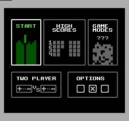
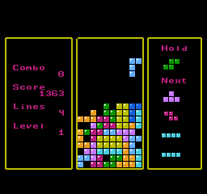
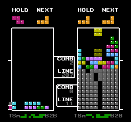
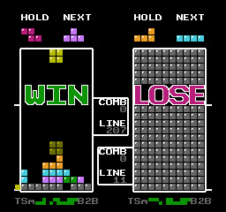
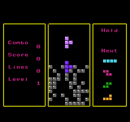
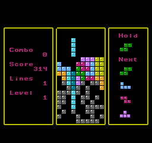

# Legally Distinct Falling Block Game










## Features

- Single Player
- Two Player
- Super Rotation System (SRS)
- Hold Piece
- 7 Piece Bag
- Wall Kicks
- T-Spins
- Garbage attacks in Two Player
- Correct block colors
- Settings menu
- Practice menu
- More game modes
- High Scores
- Some audio

## Building

### Required

- GNU Make
- CC65 suite
- Golang
- Git

### Optional

- Aseprite
- Tiled
- Famistudio

### Building

```
git clone https://github.com/zorchenhimer/nes-tetris.git
cd nes-tetris
make
```

After running `make` the ROM should end up in `bin/`

# License

MIT license, see `LICENSE.txt`.
